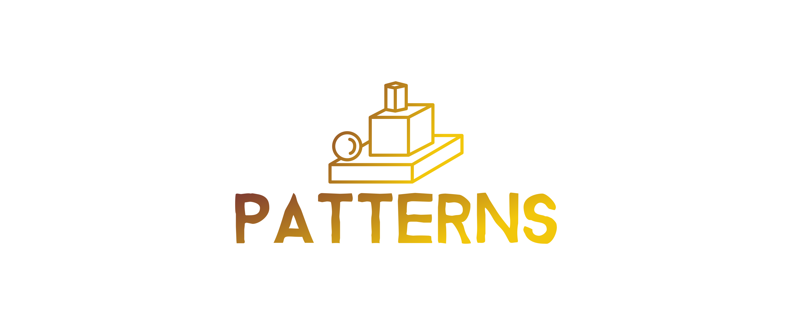
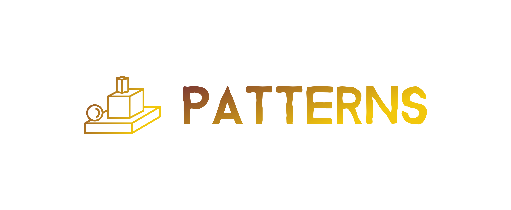

# Logotyp application.pl
+ [Landing page: www.patterns.pl](https://www.patterns.pl/)
+ [Dokumentacja](https://docs.patterns.pl/)
+ [Logo.patterns.pl](https://logo.patterns.pl/)

## Font

        Font in use <a target="_blank" href="https://www.dropbox.com/s/7i4p46rwct96846/Bizon-typeface.zip?dl=0">Bizon</a> designed by
        <a target="_blank" href="http://www.studiofago.com/">Fago Studio</a>
        and licensed under
        <a target="_blank" href="https://www.dropbox.com/s/7i4p46rwct96846/Bizon-typeface.zip?dl=0&amp;file_subpath=%2FTypeface+Bizon.rtf">Free for personal &amp; commercial use.</a>
          Icon Designed by
          <a target="_blank" href="https://thenounproject.com/evgenyk">Zhenya_K</a>

## Font
  
    #7D3A32, #F2C70C

## Background

    transparent

## Icon
     
    #7D3A32, #F2C70C
    
    
## logo

## 1

## 2

